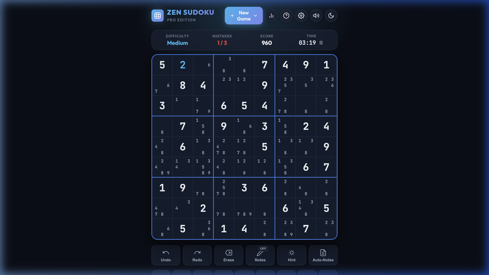
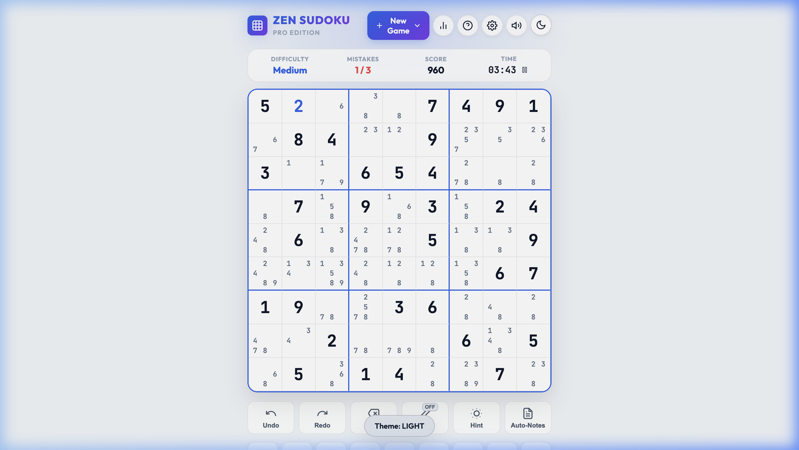
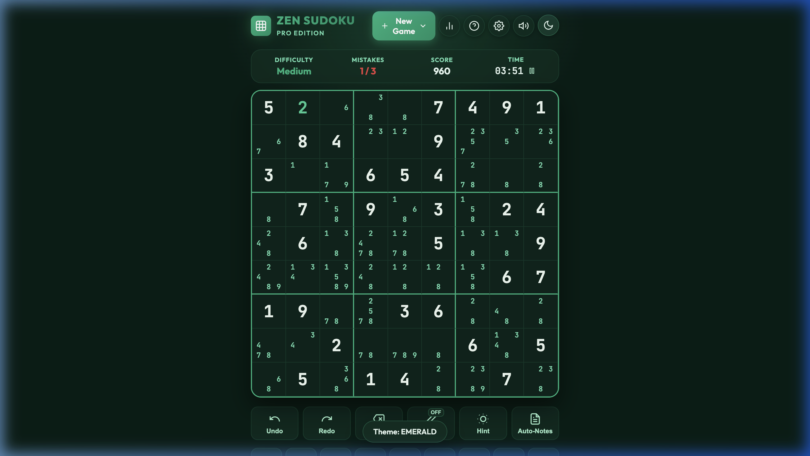
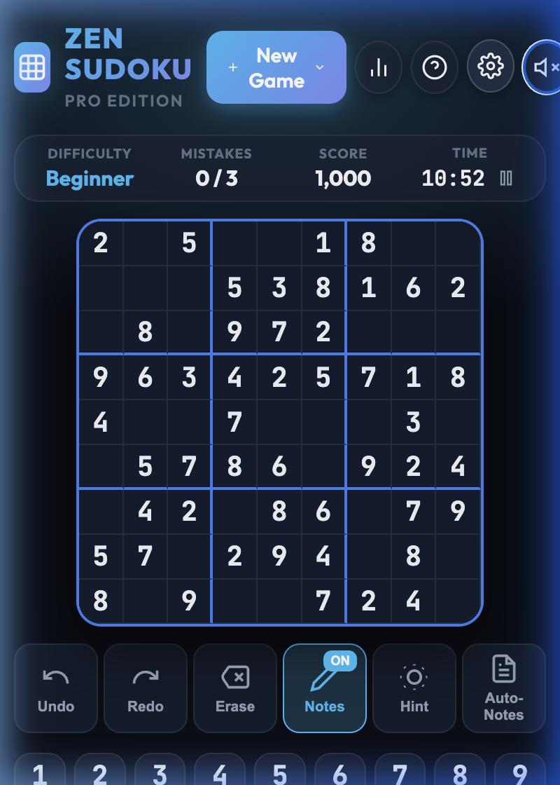
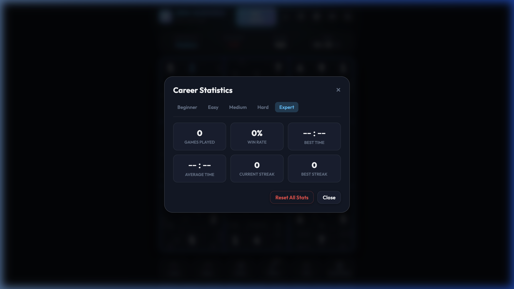
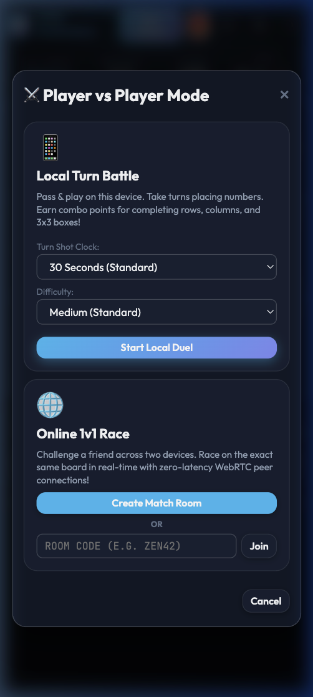
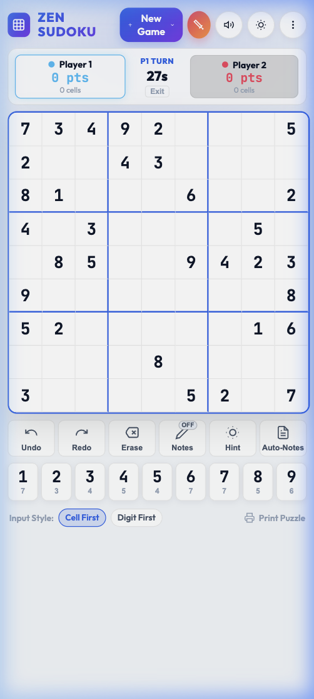
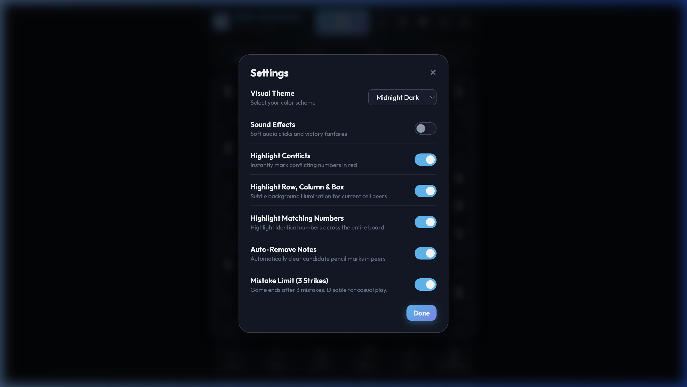

# 🕹️ MultiGame Arcade

A collection of beautiful, premium browser games — all built with pure HTML5, CSS3, and Modular ES6+ JavaScript. No frameworks, no build steps, no dependencies.

🚀 **Live Demo:** [https://techyshahid.github.io/multigame/](https://techyshahid.github.io/multigame/)

---

## 🎮 Games

### 🧩 Zen Sudoku Pro

A modern, responsive, and feature-rich 9×9 Sudoku web app with procedural board generation (unique solutions), candidate pencil notes, smart educational hints, career statistics, ambient Web Audio sound effects, and PvP multiplayer.

**[▶ Play Zen Sudoku](https://techyshahid.github.io/multigame/sudoku/)**

#### Highlights

- **⚔️ Player vs Player (PvP) Modes**:
  - **Local Turn Battle (Pass & Play)**: Two players take turns on a shared board with scoring, combos, and an optional shot-clock.
  - **Online 1v1 Race (WebRTC PeerJS)**: Zero-backend peer-to-peer real-time race via 5-letter Room Codes.
- **Procedural Generation & Solver**: Backtracking algorithm with unique solution guarantees across 5 difficulty levels (Beginner → Expert).
- **Candidate Notes**: 3×3 mini-grid inside empty cells with one-click **Auto-Fill Candidates** and automatic peer note cleanup.
- **Smart Educational Hints**: Step-by-step logical deductions (Naked Singles, Hidden Singles, conflict detection).
- **Dual Input Modes**: Cell First or Digit First for rapid board filling.
- **Single-Screen Mobile Layout**: `100dvh` dynamic height — zero vertical scrolling on mobile.
- **Web Audio API**: Synthesized clicks, pencil scribbles, error buzzes, and victory fanfares with zero external audio files.
- **Confetti Cannon**: Canvas particle system celebrating puzzle completion.
- **Career Statistics**: Games played, win rate, best time, average time, and win streaks per difficulty via `localStorage`.
- **Custom Board & Solver**: Input or solve custom 81-character puzzle strings.
- **3 Visual Themes**: Midnight Dark, Porcelain Light, Matrix Emerald.
- **Printable**: Clean `@media print` stylesheet for paper puzzle sheets.

---

### 🍬 Candy Crush

A sweet match-3 puzzle game with special candies, cascading combos, and 30 levels of sugary fun.

**[▶ Play Candy Crush](https://techyshahid.github.io/multigame/candy-crush/)**

#### Highlights

- **30 Levels** of progressively challenging match-3 gameplay.
- **Special Candies**: Striped, wrapped, and color bombs with spectacular chain reactions.
- **Cascading Combos**: Gravity-driven chain matches for massive scores.
- **Beautiful Animations**: Smooth swaps, explosions, and particle effects.
- **Responsive Design**: Plays great on desktop and mobile.

---

## 📸 Screenshots

### Zen Sudoku — Midnight Dark (Default Theme)


### Zen Sudoku — Multiple Visual Themes
| Porcelain Light | Matrix Emerald |
| :---: | :---: |
|  |  |

### Zen Sudoku — Mobile & Dashboards
| Single-Screen Mobile Layout | Career Statistics |
| :---: | :---: |
|  |  |

### Zen Sudoku — PvP Mode
| PvP Mode Selector | Local Turn Battle (Live Duel) |
| :---: | :---: |
|  |  |

### Zen Sudoku — Settings & Customization


---

## ⌨️ Keyboard Shortcuts (Sudoku)

| Key | Action |
| :--- | :--- |
| `1` – `9` | Place number or candidate note |
| `Arrow Keys` / `W` `A` `S` `D` | Navigate cells |
| `Delete` / `Backspace` | Erase cell |
| `N` | Toggle pencil notes mode |
| `H` | Get a smart hint |
| `Ctrl` + `Z` / `U` | Undo move |
| `Ctrl` + `Y` | Redo move |
| `Space` / `P` | Pause / Resume |

---

## 📁 Project Structure

```
multigame/
├── index.html          ← Game hub / landing page
├── README.md
├── sudoku/
│   ├── index.html
│   ├── style.css
│   └── js/
│       ├── app.js
│       ├── audio.js
│       ├── confetti.js
│       ├── pvp-local.js
│       ├── pvp-online.js
│       ├── storage.js
│       └── sudoku-engine.js
├── candy-crush/
│   ├── index.html
│   ├── style.css
│   └── js/
│       └── app.js
└── screenshots/
```

---

## 🚀 Local Development

No build steps or bundlers required. Run with any local HTTP server:

```bash
# Using Python
python3 -m http.server 8080

# Or using Node
npx serve .
```

Open `http://localhost:8080` in your browser.

---

## 📄 License

MIT © [Shahid Khan](https://github.com/TechyShahid)
